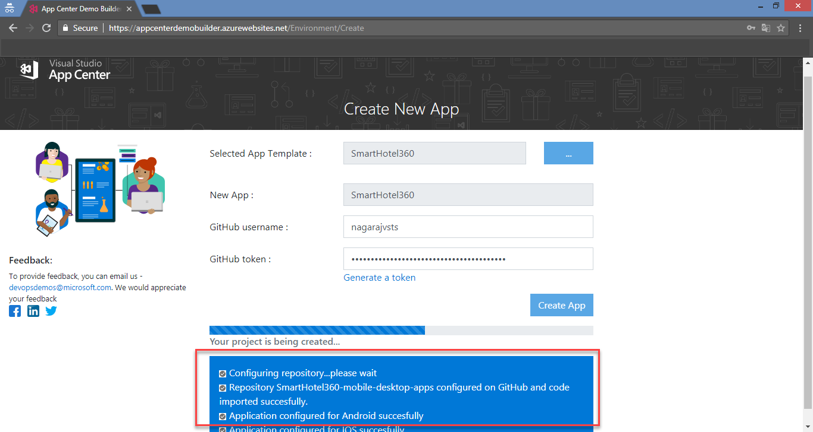

# APP CENTER DEMO BUILDER 

## 1. Open [App Center Demo Builder](https://appcenterdemobuilder.azurewebsites.net/) site on your browser:

## Before you start: 
> Before you start using the tool you need to get :

  * API Token for App Center.
  * Personal Access Token (PAT) for GitHub.
  * Install App Center Application available on GitHub marketplace to GitHub.

> Links are provided on the **Before you start** section on the site to get above things done.

1. Enter Valid **App Center API Token**.  
2. Click on **Verify & Continue** button.

## 2. In App creation page, click on **App Template** button and select a template to create apps. By default **SmartHotel360** template will be selected.

## 3.On template selection popup, select a template and click on **Select Template** button:

## 4. Once the template is selected, provide a name for application to be created and enter valid GitHub username and token. Click on **Create App** button:

## 5. Status messages will be shown which indicates the process of each steps DemoBuilder performs:

## 6. A **repository** will be created in the GitHub account that you have provided and source code will be imported which is used in build configuration of applictaion:

## 7. DemoBuilder may take couple of minutes to provision the applictaions, when it completes you will be provided with a link to the appliction created:

## 8. Click on the link provided, you redirect to AppCenter portal where you can find created **Applications** along with a **Organization**:

